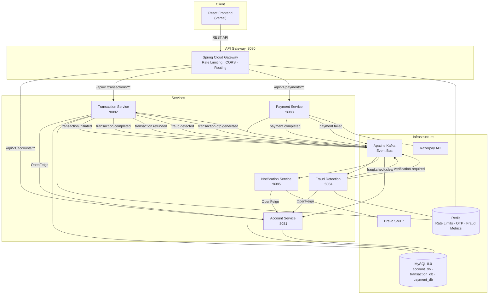
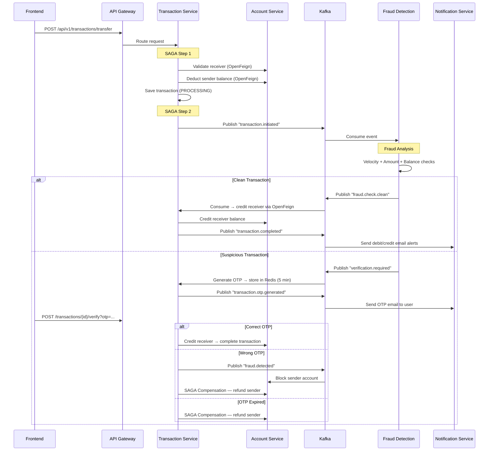

# 🏦 Digital Banking System

A full-stack, microservices-based digital banking platform built with **Java 17, Spring Boot 4.1 and React 19**. Implements real-world distributed systems patterns including the **SAGA pattern** for money transfers, **event-driven architecture** with Apache Kafka, **real-time fraud detection** with Redis, and **Razorpay payment gateway** integration — deployed on **AWS EC2** with a **Jenkins CI/CD** pipeline.


[🌐 Live Application](http://digital-banking-system-two.vercel.app/) &nbsp;·&nbsp; [🐙 GitHub](https://github.com/Sagar-devx/digital-banking-system)

---

## Project Highlights

| Area | Implementation |
|---|---|
| **Architecture** | 5 microservices + API Gateway, event-driven with Kafka |
| **Backend** | Java 17, Spring Boot 4.1, Spring Cloud 2025.1.2 |
| **Frontend** | React 19, Vite 8, Tailwind CSS 4 |
| **Distributed Transactions** | SAGA pattern with compensating transactions |
| **Messaging** | Apache Kafka — 9 event topics across services |
| **Caching & OTP** | Redis — rate limiting, OTP storage, fraud velocity tracking |
| **Database** | MySQL 8.0 — database-per-service pattern |
| **Payments** | Razorpay integration with webhook verification |
| **Notifications** | Kafka-driven HTML email alerts via Brevo SMTP |
| **DevOps** | Docker (multi-stage builds), Docker Compose, Jenkins CI/CD |
| **Deployment** | Frontend on Vercel, Backend on AWS EC2 |
| **Testing** | JUnit 5 + Mockito — unit tests across all services |

---

## Key Features

### 🏦 Account Management
- Create bank accounts (Savings/Current) with auto-generated 12-digit account numbers
- View account details and real-time balance
- Account blocking on fraud detection

### 💸 Money Transfers (SAGA Pattern)
- Peer-to-peer transfers with sender validation, recipient verification, and balance deduction
- Automated fraud screening before completion
- OTP verification for suspicious transactions (stored in Redis with 5-min expiry)
- Compensating transactions — automatic refund on failure, OTP expiry, or wrong OTP

### 🔍 Real-Time Fraud Detection
- **Velocity check** — flags accounts exceeding 5 transactions/minute
- **Amount anomaly** — flags transactions exceeding 5× the running average
- **Balance threshold** — flags transactions exceeding 90% of account balance
- Auto-triggers OTP verification or account blocking

### 💳 Razorpay Payments
- Create payment orders via Razorpay API
- Frontend payment confirmation flow
- Server-side webhook handling (`payment.captured`, `payment.failed`)
- Webhook signature verification for security

### 🔔 Email Notifications (Kafka-Driven)
- OTP verification emails with styled HTML templates
- Debit/credit alerts for both sender and receiver
- Fraud detection alerts with account blocking notice
- Refund confirmation emails
- Payment success/failure notifications

### 📊 System Health Dashboard
- Real-time health monitoring of all microservices via Actuator endpoints
- Service status visualization in the frontend

---

## Tech Stack

| Category | Technologies |
|---|---|
| **Backend** | Java 17, Spring Boot 4.1.0, Spring Cloud 2025.1.2 |
| **API Gateway** | Spring Cloud Gateway (WebFlux) |
| **Inter-Service Comm.** | OpenFeign (synchronous), Apache Kafka (asynchronous) |
| **Database** | MySQL 8.0, Spring Data JPA, Hibernate |
| **Caching** | Redis — rate limiting, OTP storage, fraud metrics |
| **Messaging** | Apache Kafka with Zookeeper |
| **Payments** | Razorpay Java SDK |
| **Notifications** | JavaMail (Brevo SMTP), HTML email templates |
| **Frontend** | React 19, Vite 8, Tailwind CSS 4, React Router 7, Axios |
| **Build Tool** | Maven 3.9, npm |
| **Testing** | JUnit 5, Mockito, Spring Boot Test |
| **Containerization** | Docker (multi-stage builds), Docker Compose |
| **CI/CD** | Jenkins (Test → Build → Push → Deploy) |
| **Cloud** | AWS EC2, Docker Hub (`sagr9900/*`), Vercel |
| **Monitoring** | Spring Boot Actuator |

---

## Microservices Architecture



### Service Overview

| Service | Port | Responsibility | Database / Storage |
|---|---|---|---|
| **API Gateway** | 8080 | Request routing, Redis-backed rate limiting (IP-based), CORS | Redis |
| **Account Service** | 8081 | Account CRUD, balance deduction/credit (SAGA steps), fraud-triggered blocking | MySQL (`account_db`) |
| **Transaction Service** | 8082 | Transfer orchestration (SAGA coordinator), OTP verification, transaction history | MySQL (`transaction_db`), Redis |
| **Payment Service** | 8083 | Razorpay order creation, payment confirmation, webhook processing | MySQL (`payment_db`) |
| **Fraud Detection** | 8084 | Velocity/amount/balance fraud rules, triggers OTP or clean result | Redis |
| **Notification Service** | 8085 | Kafka consumer — sends styled HTML emails for all banking events | — |

---

## System Flows

### 💸 Money Transfer — SAGA Pattern

This is the core workflow demonstrating distributed transaction management with compensating actions.



---

## Kafka Event Topology

| Topic | Producer | Consumer(s) | Purpose |
|---|---|---|---|
| `transaction.initiated` | Transaction Service | Fraud Detection | Trigger fraud check on every transfer |
| `fraud.check.clean` | Fraud Detection | Transaction Service | Transaction passed — proceed to completion |
| `verification.required` | Fraud Detection | Transaction Service | Suspicious — generate OTP for verification |
| `transaction.otp.generated` | Transaction Service | Notification Service | Send OTP email to user |
| `transaction.completed` | Transaction Service | Notification Service, Account Service | Send debit/credit alerts |
| `transaction.refunded` | Transaction Service | Notification Service | Send refund confirmation |
| `fraud.detected` | Transaction Service | Account Service, Notification Service | Block account + send alert |
| `payment.completed` | Payment Service | Notification Service, Account Service | Credit account + send confirmation |
| `payment.failed` | Payment Service | Notification Service | Send payment failure alert |

---

## Redis Usage

| Service | Key Pattern | Purpose | TTL |
|---|---|---|---|
| **API Gateway** | IP-based keys | Rate limiting (10 req/s accounts, 5 req/s payments) | Auto |
| **Transaction Service** | `transaction:otp:{txId}` | OTP storage for suspicious transactions | 5 minutes |
| **Fraud Detection** | `fraud:velocity:{accountNo}` | Transaction count per minute | 60 seconds |
| **Fraud Detection** | `fraud:avg_amount:{accountNo}` | Running average transaction amount | Persistent |

---

## Database & Data Ownership

The project follows the **database-per-service** pattern. Each service owns its data exclusively.

```
MySQL 8.0
├── account_db      → Account Service (accounts table)
├── transaction_db  → Transaction Service (transactions table)
└── payment_db      → Payment Service (payments table)
```

Fraud Detection and Notification services are **stateless** — they use Redis (fraud) and external SMTP (notification) instead of a database.

---

## Unit Testing

All services have comprehensive unit tests using **JUnit 5** and **Mockito**.

| Service | Test Files | What's Tested |
|---|---|---|
| **Account Service** | `AccountServiceImplTest`, `AccountControllerTest`, `AccountEventConsumerTest` | Account CRUD, balance operations, insufficient funds, duplicate email, Kafka event consumption |
| **Transaction Service** | `TransactionServiceImplTest`, `TransactionControllerTest` | SAGA flow, OTP verification (correct/wrong/expired), refund compensation, Kafka event publishing |
| **Payment Service** | `PaymentServiceImplTest`, `PaymentControllerTest` | Razorpay order creation, webhook handling (captured/failed/unknown events) |
| **Fraud Detection** | `FraudDetectionServiceImplTest` | Velocity check, amount anomaly detection, balance threshold, clean transaction passthrough |
| **Notification Service** | `NotificationServiceImplTest` | OTP email, debit/credit alerts, fraud alerts, refund notifications, payment confirmations |

Tests mock external dependencies (Redis, Kafka, Feign clients, Razorpay SDK) using Mockito to ensure isolated unit testing.

---

## Frontend

Built with **React 19**, **Vite 8**, and **Tailwind CSS 4**. Deployed on **Vercel** with API proxy to the backend on AWS EC2.

### Pages

| Page | Route | Description |
|---|---|---|
| Landing | `/` | Account login via account number |
| Create Account | `/accounts/create` | New account registration form |
| Dashboard | `/dashboard` | Account overview with balance |
| Transfer | `/transfer` | Money transfer with OTP verification flow |
| Transactions | `/transactions` | Transaction history list |
| Transaction Detail | `/transactions/:id` | Individual transaction details |
| Payments | `/payments` | Razorpay payment integration |
| System Health | `/system` | Live microservice health dashboard |
| Architecture | `/architecture` | System architecture visualization |

> **Route Protection**: Dashboard routes are protected — users must be logged in (account number stored in `localStorage`) to access banking features.

---

## API Overview

| Service | Endpoints | Purpose |
|---|---|---|
| **Account Service** | `POST /api/v1/accounts` | Create new account |
| | `GET /api/v1/accounts/{accountNumber}` | Get account details |
| | `GET /api/v1/accounts/{accountNumber}/balance` | Get balance |
| | `PUT /api/v1/accounts/{accountNumber}/block` | Block account |
| | `PUT /api/v1/accounts/{accountNumber}/deduct` | Deduct balance (internal SAGA) |
| | `PUT /api/v1/accounts/{accountNumber}/credit` | Credit balance (internal SAGA) |
| **Transaction Service** | `POST /api/v1/transactions/transfer` | Initiate money transfer |
| | `GET /api/v1/transactions/{transactionId}` | Get transaction details |
| | `GET /api/v1/transactions/account/{accountNumber}` | Transaction history |
| | `POST /api/v1/transactions/{transactionId}/verify` | Verify OTP |
| **Payment Service** | `POST /api/v1/payments/create-order` | Create Razorpay order |
| | `POST /api/v1/payments/confirm` | Confirm frontend payment |
| | `POST /api/v1/payments/webhook` | Razorpay webhook handler |

Health endpoints are exposed via API Gateway at `/health/{service}` → proxied to each service's `/actuator/health`.

---

## Docker & Deployment

### Containers (Docker Compose)

| Container | Image | Purpose |
|---|---|---|
| `redis` | `redis:latest` | Caching, rate limiting, OTP store |
| `mysql` | `mysql:8.0` | Persistent database with init script |
| `zookeeper` | `confluentinc/cp-zookeeper:7.4.0` | Kafka coordination |
| `kafka` | `confluentinc/cp-kafka:7.4.0` | Event bus |
| `account-service` | Multi-stage build | Account management |
| `transaction-service` | Multi-stage build | Transfer orchestration |
| `payment-service` | Multi-stage build | Payment processing |
| `fraud-detection-service` | Multi-stage build | Fraud analysis |
| `notification-service` | Multi-stage build | Email dispatch |
| `api-gateway` | Multi-stage build | Request routing & rate limiting |

All services use **multi-stage Docker builds** (Maven build → Alpine JRE runtime) for minimal image size.

### CI/CD Pipeline (Jenkins)

```
Test → Build & Push (Docker Hub) → Deploy to AWS EC2
```

1. **Test** — Runs `mvn test` for all 6 services inside Docker containers
2. **Build & Push** — Builds Docker images, pushes to Docker Hub (`sagr9900/*`)
3. **Deploy** — SSH into AWS EC2 → `docker compose pull && docker compose up -d`

---

## Local Setup

### Prerequisites

- Java 17+
- Maven 3.9+
- Node.js 18+
- Docker & Docker Compose

### Clone

```bash
git clone https://github.com/Sagar-devx/digital-banking-system.git
cd digital-banking-system
```

### Environment Variables

```bash
cp backend/.env.example backend/.env
```

```env
# Database
DB_HOST=mysql
DB_PORT=3306
DB_USERNAME=root
DB_PASSWORD=root

# Redis
SPRING_DATA_REDIS_HOST=redis
SPRING_DATA_REDIS_PORT=6379

# Kafka
SPRING_KAFKA_BOOTSTRAP_SERVERS=kafka:29092

# Razorpay (Payment Service)
RAZORPAY_KEY_ID=
RAZORPAY_KEY_SECRET=
RAZORPAY_WEBHOOK_SECRET=

# SMTP (Notification Service)
SPRING_MAIL_HOST=smtp-relay.brevo.com
SPRING_MAIL_PORT=587
SPRING_MAIL_USERNAME=
SPRING_MAIL_PASSWORD=
SPRING_MAIL_FROM=
```

### Run with Docker Compose (Recommended)

```bash
cd backend
docker compose up --build
```

This starts all infrastructure (MySQL, Redis, Kafka, Zookeeper) and all 6 microservices.

### Run Frontend

```bash
cd frontend
npm install
npm run dev
```

Frontend runs on `http://localhost:5173` and proxies API calls to the backend on port 8080.

### Run Tests

```bash
# Run tests for a specific service
cd backend/account-service
mvn test

# Run tests for all services
cd backend
for dir in account-service transaction-service payment-service fraud-detection-service notification-service api-gateway; do
  (cd $dir && mvn test)
done
```

---

## Project Structure

```
digital-banking-system/
│
├── frontend/                          # React 19 + Vite + Tailwind CSS
│   ├── src/
│   │   ├── api/                       # Axios API client
│   │   ├── components/                # UI components (by feature)
│   │   ├── context/                   # React Context (Account state)
│   │   ├── layouts/                   # Main & Dashboard layouts
│   │   ├── pages/                     # Route pages
│   │   └── utils/                     # Utility functions
│   └── vercel.json                    # Vercel deployment + API proxy
│
├── backend/
│   ├── api-gateway/                   # Spring Cloud Gateway (WebFlux)
│   │   └── config/                    # RateLimiter, CORS
│   │
│   ├── account-service/               # Account CRUD + SAGA participant
│   │   ├── controller/
│   │   ├── service/                   # Business logic + Kafka consumer
│   │   ├── entity/                    # Account, AccountType, AccountStatus
│   │   └── exception/                 # Global exception handler
│   │
│   ├── transaction-service/           # SAGA coordinator
│   │   ├── controller/
│   │   ├── service/                   # Transfer logic + Kafka consumer
│   │   ├── client/                    # OpenFeign → Account Service
│   │   ├── event/                     # Kafka event DTOs
│   │   └── entity/                    # Transaction, TransactionStatus
│   │
│   ├── payment-service/               # Razorpay integration
│   │   ├── controller/                # Payment + Webhook endpoints
│   │   ├── service/                   # Order creation, webhook handling
│   │   └── config/                    # Webhook signature verifier
│   │
│   ├── fraud-detection-service/       # Rule-based fraud engine
│   │   ├── service/                   # Fraud rules + Kafka consumer
│   │   ├── client/                    # OpenFeign → Account Service
│   │   └── model/                     # FraudCheckResult
│   │
│   ├── notification-service/          # Kafka-driven email service
│   │   ├── service/                   # 6 Kafka listeners + HTML email builder
│   │   └── client/                    # OpenFeign → Account Service
│   │
│   ├── docker/mysql/init.sql          # Database initialization
│   ├── docker-compose.yml             # Local development
│   ├── docker-compose-prod.yml        # Production (Docker Hub images)
│   └── Jenkinsfile                    # CI/CD pipeline
```

---

## Engineering Highlights

- **SAGA Pattern** — Transaction Service orchestrates distributed transfers with compensating transactions (refunds) on failure, ensuring data consistency across services without distributed locks
- **Event-Driven Architecture** — 9 Kafka topics decouple services; fraud detection, notifications, and account blocking happen asynchronously
- **Real-Time Fraud Detection** — Three-rule engine (velocity, amount anomaly, balance threshold) using Redis for fast fraud checks
- **Redis Multi-Purpose** — Single Redis instance serves rate limiting (API Gateway), OTP storage with TTL (Transaction Service), and fraud velocity/average tracking (Fraud Detection)
- **API Gateway** — Spring Cloud Gateway with IP-based rate limiting (Redis-backed `RequestRateLimiter`), centralized CORS, and health check aggregation
- **Database-Per-Service** — Each service owns its schema; inter-service data access happens exclusively through APIs
- **Multi-Stage Docker Builds** — Maven build stage + Alpine JRE runtime for minimal production images
- **CI/CD Pipeline** — Jenkins automates test → build → push (Docker Hub) → deploy (AWS EC2 via SSH)
- **Webhook Security** — Razorpay webhook signature verification prevents tampered payment callbacks
- **Comprehensive Unit Tests** — JUnit 5 + Mockito tests cover service logic, controller endpoints, Kafka consumers, and edge cases (insufficient funds, expired OTP, wrong OTP, duplicate accounts)

---

## Author

**Sagar Sharma**

Full Stack Java Developer

[](https://github.com/Sagar-devx)

---

<p align="center">
  <sub>Built with ☕ Java, ⚛️ React, and a lot of engineering effort.</sub>
</p>